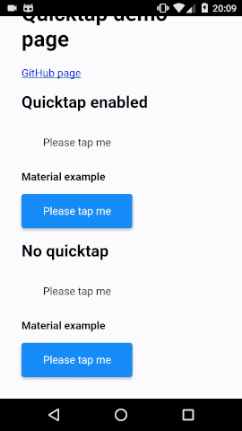

# `quicktap`

`quicktap` is an :active replacement that doesn't delay on mobile



> `quicktap` in action (see [demo](https://marcoms.github.io/quicktap))

## Background

From the above GIF, you may notice how the bottom buttoms take longer to respond to presses on the mobile device than the top buttons. Unfortunately this still is the case in Chrome today.

Some time ago, [Chrome removed the infamous 300ms click delay on mobile](https://developers.google.com/web/updates/2013/12/300ms-tap-delay-gone-away), however, a small yet noticeable delay still exists between a `touchstart` event and the element to be marked with the `:active` CSS pseudo-class. This causes the lag observable in the GIF.

`quicktap` gets around this problem by listening for `touchstart` and `touchend` events (among others), and adding and removing a CSS class on an element accordingly. With these changes, it noticeably improves the user experience, since there is almost instant feedback from a user interaction. You can see this in the top buttons in the GIF.

It is important to know that `quicktap` does not intefere with any `click` events and so should not affect the browser's behaviour.

## Using `quicktap`

Obtain a reference to the element you want to apply `quicktap` enhancements to.

```js
const targetElement = document.querySelector("#target-element");
```

Apply using `quicktap.apply`.

```js
quicktap.apply(targetElement);
```

Now, instead of using the `:active` selector in your CSS, switch to using `.active` (or what you have set `quicktap.tag` to).

```css
.button.active {
	background: black;
	color: white;
}
```

### Using a different class name

You may set `quicktap.tag` to a string different to the default value of `"active"`, perhaps to prevent clashes with your current codebase. After you have done so, you may use this tag in your CSS.

```js
quicktap.tag = "radioactive";
```

```css
.button.radioactive {
	background: hotpink;
	color: white;
}
```

## API

### `quicktap.tag`

Default: `"active"`

String to use as the class name for elements which have been activated by a touch or mouse event.

### `quicktap.apply(el)`

Applies `quicktap` enhancements to `el`.

More specifically, this adds event listeners to `el` that await mouse and touch events, which causes an element to be activated or deactivated.

## License

MIT (see license.txt)
