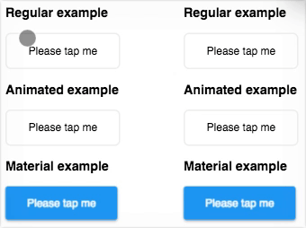

# `quicktap`

`quicktap` is an :active replacement that doesn't delay on mobile



> `quicktap` in action (see [demo](https://marcoms.github.io/quicktap/demo) on a mobile device or using mobile emulation in Chrome DevTools)

## Background

From the above GIF, you may notice how the bottom buttoms take longer to respond to presses on the mobile device than the top buttons. Unfortunately this still is the case in Chrome and Firefox today.

At this time, both Chrome and Firefox have a small delay between the `touchstart` event and actually adding the `:active` pseudoclass to the element. It is assumed that this is the case to prevent panning or scrolling from causing the `:active` selector to match when the user didn't intend to click on an element (yet why is this not also the case when a user drags across text to select it on desktop?). These are valid concerns and those who value them shoud stick with their current system, but for those who value instant user feedback more, this library could be used.

`quicktap` gets around this by listening for `touchstart` and `touchend` events (among others), and adding and removing a CSS class on an element accordingly. With these changes, it noticeably improves the user experience, since there is almost instant feedback from a user interaction. You can see this in the top buttons in the GIF.

It is important to know that `quicktap` does not intefere with any `click` events and so should not affect the browser's behaviour. Also, this is not dealing with the infamous "300ms click delay" which is a separate and solved issue in most browsers and by the [FastClick](https://github.com/ftlabs/fastclick) library.

## Using `quicktap`

Apply quicktap enhancements to your chosen element.

```js
quicktap.apply(`#target-element`);
```

Now, the element will have the `.active` class (or a unique one if you have changed `quicktap.class` yourself) when it is pressed.

```css
#target-element {
	background: white;
	color: blue;
}

#target-element.active {
	background: blue;
	color: white;
}
```

## API

### `quicktap.class`

Default: `"active"`

String to use as the class name for elements which have been activated by a touch or mouse event.

#### Example

##### JS

```js
quicktap.class = "radioactive";
```

##### CSS

```css
.button.radioactive {
	background: hotpink;
	color: white;
}
```

### `quicktap.apply(elOrEls)`

Applies `quicktap` enhancements to `elOrEls`.

`elOrEls` may be one of `HTMLElement`, `string` (selector), `NodeList` (returned by DOM methods such as `querySelector`, or `Array`.

Returns all of the elements that have been successfully modified.

#### Examples

```js
// single element

const elementReference = document.querySelector(`#target-element`);
quicktap.apply(elementReference);

// selector

quicktap.apply(`.selector`);

// NodeList

const elementReferences = document.querySelectorAll(`.selector`);
quicktap.apply(elementReferences);

// array

const elementArray = [
	document.querySelector(`#a`),
	document.querySelector(`#b`),
	document.querySelector(`#c`),
];

quicktap.apply(elementArray);
```

## License

MIT (see license.txt)
